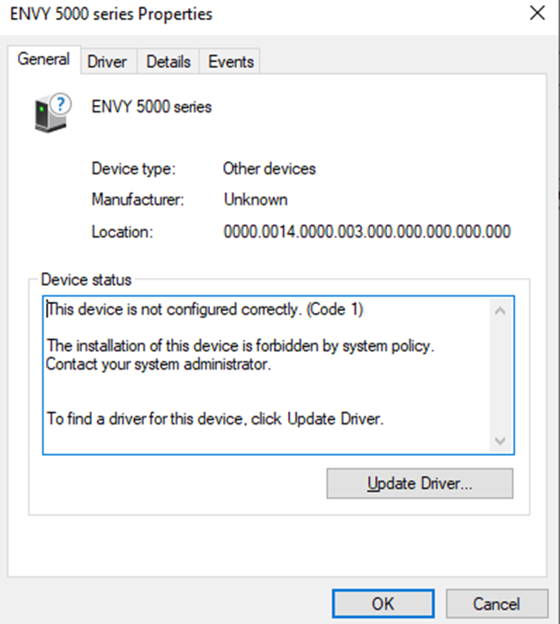
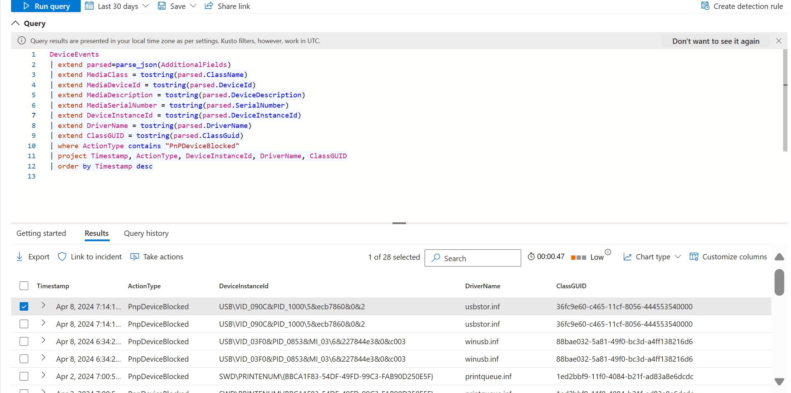
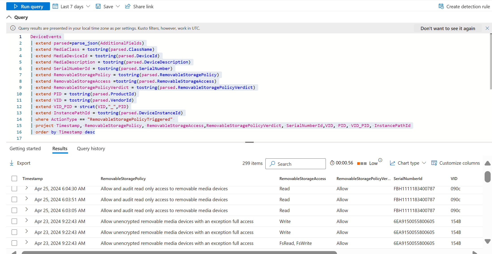

# Device control in Microsoft Defender for Endpoint

**Applies to:**

- [Microsoft Defender for Endpoint Plan 1](microsoft-defender-endpoint.md)
- [Microsoft Defender for Endpoint Plan 2](microsoft-defender-endpoint.md)
- [Microsoft Defender for Business](/defender-business)

Device control capabilities in Microsoft Defender for Endpoint enable your security team to control whether users can install and use peripheral devices, like removable storage (USB thumb drives, CDs, disks, etc.), printers, Bluetooth devices, or other devices with their computers. Your security team can configure device control policies to configure rules like these:

- Prevent users from installing and using certain devices (like USB drives)
- Prevent users from installing and using *any* external devices with specific exceptions
- Allow users to install and use specific devices
- Allow users to install and use only [BitLocker](/windows/security/operating-system-security/data-protection/bitlocker/)-encrypted devices with Windows computers

This list is intended to provide some examples. It's not an exhaustive list; there are other examples to consider (see the [device control in Windows](#device-control-in-windows) section in this article). 

Device control helps protect your organization from potential data loss, malware, or other cyberthreats by allowing or preventing certain devices to be connected to users' computers. With device control, your security team can determine whether and what peripheral devices users can install and use on their computers. 

## Microsoft device control capabilities

Device control capabilities from Microsoft can be organized into three main categories: device control in Windows, device control in Defender for Endpoint, and Endpoint Data Loss Prevention (Endpoint DLP).

- **Device control in Windows**. The Windows operating system has built-in device control capabilities. Your security team can configure device installation settings to prevent (or allow) users from installing certain devices on their computers. Policies are applied at the device level, and use various device properties to determine whether or not a user can install/use a device. Device control in Windows works with BitLocker and ADMX templates, and can be managed using Intune.

  - **BitLocker -** [BitLocker](/windows/security/operating-system-security/data-protection/encrypted-hard-drive) is a Windows security feature that provides encryption for entire volumes.  BitLocker encryption can be required for writing to removable media. Together with [Intune](/mem/intune/fundamentals/what-is-intune), policies can be configured to enforce encryption on devices using BitLocker for Windows .  For more information, see [Disk encryption policy settings for endpoint security in Intune](/mem/intune/protect/endpoint-security-disk-encryption-profile-settings).
    
  - **Device Installation**. Windows provides the capability to prevent the installation of specific types of USB devices. 
    
    - For more information on how to configure device installation with Intune, see [Restrict USB devices and allow specific USB devices using ADMX templates in Intune](/mem/intune/configuration/administrative-templates-restrict-usb).
        
    - For more information on how to configure device installation with Group Policy, see [Manage Device Installation with Group Policy](/windows/client-management/client-tools/manage-device-installation-with-group-policy)
        
- **Device control in Defender for Endpoint -**  Device control in Defender for Endpoint provides more advanced capabilities and is cross platform. 

     - Granular access control - create policies to control access by device, device type, operation (read, write, execute), user group, network location or file type.
  
     - File evidence - store the file information and contents to audit files copied or accessed on devices.
  
     - Reporting and advanced hunting - complete visibility into add device related activities
  
     - Device control in Microsoft Defender can be managed using Intune or [Group Policy](device-control-deploy-manage-gpo)
  
    - **Device control in Microsoft Defender and Intune**. Intune provides a rich experience for managing complex device control policies for organizations. You can configure and deploy device restriction settings in Defender for Endpoint, for example. See [Deploy and manage device control with Microsoft Intune](device-control-deploy-manage-intune).
        
- **Endpoint data loss prevention** (Endpoint DLP). Endpoint DLP monitors sensitive information on devices that are onboarded to Microsoft Purview solutions. DLP policies can enforce protective actions on sensitive information and where it's stored or used. [Learn about Endpoint DLP](/purview/endpoint-dlp-learn-about).

See the [device control scenarios](#device-control-in-windows) section (in this article) for more details about these capabilities.


> [!TIP]
> If you're using Mac, device control can control access to Bluetooth, iOS devices, portable devices such as cameras, and removable media such as USB devices. See [Device Control for macOS](mac-device-control-overview.md).

Select a tab, review the scenarios, and then identify which Microsoft capability to use

## **[Controlling access to USB devices](#tab/Removable)**

### Device installation restrictions 

The device installation restrictions available in Windows allow or deny the installation of drivers based on the device ID, device instance ID or set-up class.  This can block __any__ device in the device manager including all removable devices.  When device installation restrictions are applied, the device is blocked in the device manager.   


There are more details available by clicking on the device.



There will also be a record in Advanced Hunting


```kusto
DeviceEvents
| extend parsed=parse_json(AdditionalFields)
| extend MediaClass = tostring(parsed.ClassName)
| extend MediaDeviceId = tostring(parsed.DeviceId)
| extend MediaDescription = tostring(parsed.DeviceDescription)
| extend MediaSerialNumber = tostring(parsed.SerialNumber)
| extend DeviceInstanceId = tostring(parsed.DeviceInstanceId)
| extend DriverName = tostring(parsed.DriverName)
| extend ClassGUID = tostring(parsed.ClassGuid)
| where ActionType contains "PnPDeviceBlocked"
| project Timestamp, ActionType, DeviceInstanceId, DriverName, ClassGUID
| order by Timestamp desc

```



When a device installation restrictions are configured and a device is installed, an event with *ActionType* of _PnPDeviceAllowed_ is created

**Learn more:** 

- [Manage Device Installation with Group Policy - Windows Client Management | Microsoft Learn](/windows/client-management/client-tools/manage-device-installation-with-group-policy)

- [Restrict USB devices and allow specific USB devices using ADMX templates in Intune](/mem/intune/configuration/administrative-templates-restrict-usb).

### Controlling access to removable media with device control for Microsoft Defender for Endpoint

Device control for MDE provides finer grain access control to a subset of USB devices.  Device control can only restrict access to Windows Portal Devices, Removable Media, CD/DVDs and Printers. 

> [!NOTE]
> Removable Media is different than all USBs.  Not **all** USB devices are removable media.  In order to be considered removable media and therefore in scope of MDE device control,  the device **must** create a disk (e.g.  E: ) in Windows. 
Device control can restrict access to the device and files on that device by defining policies.  If a policy is configured with an audit entry, then an event will appear in Advanced Hunting with an *ActionType* of *RemovableStoragePolicyTriggered*


```kusto
DeviceEvents
| extend parsed=parse_json(AdditionalFields)
| extend MediaClass = tostring(parsed.ClassName)
| extend MediaDeviceId = tostring(parsed.DeviceId)
| extend MediaDescription = tostring(parsed.DeviceDescription)
| extend SerialNumberId = tostring(parsed.SerialNumber)
| extend RemovableStoragePolicy = tostring(parsed.RemovableStoragePolicy)
| extend RemovableStorageAccess =tostring(parsed.RemovableStorageAccess)
| extend RemovableStoragePolicyVerdict = tostring(parsed.RemovableStoragePolicyVerdict)
| extend PID = tostring(parsed.ProductId)
| extend VID = tostring(parsed.VendorId)
| extend VID_PID = strcat(VID,"_",PID)
| extend InstancePathId = tostring(parsed.DeviceInstanceId)
| where ActionType == "RemovableStoragePolicyTriggered" 
| project Timestamp, RemovableStoragePolicy, RemovableStorageAccess,RemovableStoragePolicyVerdict, SerialNumberId,VID, PID, VID_PID, InstancePathId
| order by Timestamp desc
```

  This query returns the name of the policy, the access requested, and the verdict (allow, deny)



## **[Controlling access to BitLocker encrypted removable media (Preview)](#tab/Bitlocker)**

### BitLocker support for removable media

Windows provides the ability to deny write to all removable media or deny write access unless a device is BitLocker encrypted.

**Learn More**
- [Configure BitLocker - Windows Security | Microsoft Learn](https://learn.microsoft.com/en-us/windows/security/operating-system-security/data-protection/bitlocker/configure?tabs=removable#policy-settings-list)


### Device control policies for BitLocker (Preview)

Device control for Microsoft Defender for Endpoint provides the ability to control access to a device based on its BitLocker encrypted state (encrypted or plain).  This allows for exceptions to be created to allow and audit access to non-BitLocker encrypted devices.

## [**Printers**](#tab/Printers)

| Scenario | Device control policy |
|---|---|
| Block people from printing via noncorporate printers | Device control in Defender for Endpoint. See [Device control policies](device-control-policies.md). |
| Only allow specific USB printer(s) by VID/PID | Device control in Defender for Endpoint. See [Device control policies](device-control-policies.md). |
| Prevent installation of all printers | Device control in Windows. See [Device control policies](device-control-policies.md). |
| Prevent installation of a specific printer | Device control in Windows. See [Device control policies](device-control-policies.md). |
| Prevent installation of all printers while allowing a specific printer to be installed | Device control in Windows. See [Device control policies](device-control-policies.md). |
| Block printing of sensitive documents to any printer | [Endpoint DLP](/purview/endpoint-dlp-learn-about) |

## [**Bluetooth**](#tab/Bluetooth)

| Scenario | Device control policy |
|---|---|
| Block copying of sensitive document to any Bluetooth Device | [Endpoint DLP](/purview/endpoint-dlp-learn-about) |


## [**Removable storage**](#tab/Removable)

| Scenario | Microsoft capability|
|---|---|
| Prevent installation of a specific USB device | Device installation in Windows. See [Device installation](/windows/client-management/client-tools/manage-device-installation-with-group-policy). |
| Prevent installation of all USB devices while allowing an installation of only an authorized USB | Device installation in Windows. See [Device installation in Windows](device-control-policies.md). |
| Prevent Write and Execute access to all but allow specific approved USBs | Device control in Defender for Endpoint. See [Device control policies](device-control-policies.md). |
| Audit Write and Execute access for all but block specific blocked USBs | Device control in Defender for Endpoint. See [Device control policies](device-control-policies.md). |
| Block read and execute access to specific file extension | Device control in Microsoft Defender. See [Device control policies](device-control-policies.md). |
| Block people from access removable storage when the machine isn't connecting corporate network | Device control in Microsoft Defender. See [Device control policies](device-control-policies.md). |
| Block write access to removable data drives not protected by BitLocker | Device control in Windows. See [BitLocker](/windows/security/operating-system-security/data-protection/bitlocker/configure?tabs=common). |
| Block write access to devices configured in another organization | Device control in Windows. See [BitLocker](/windows/security/operating-system-security/data-protection/bitlocker/configure?tabs=common). |
| Prevent copying of sensitive files to USB | [Endpoint DLP](/purview/endpoint-dlp-learn-about) |


---

## Supported devices

Device control supports Bluetooth devices, CD/ROMs and DVD devices, printers, USB devices, and other types of portable devices. On a Windows device, based on the driver, some peripheral devices are marked as removable. The following table lists examples of devices that device control supports with their `primary_id` values and media class names:

| Device type | `PrimaryId` in Windows | `primary_id` in macOS | Media Class Name |
|---|---|---|---|
| Bluetooth devices |  | `bluetoothDevice` | `Bluetooth Devices` |
| CD/ROMs, DVDs | `CdRomDevices` |  |  `CD-Roms` |
| iOS devices |  | `appleDevice` | | 
| Portable devices (such as cameras) |   | `portableDevice` | | 
| Printers | `PrinterDevices` |  | `Printers` |
| USB devices (removable media) | `RemovableMediaDevices` | `removableMedia` | `USB` | 
| Windows Portable Devices | `WpdDevices` |  | `Windows Portable Devices (WPD)` |

## Device control samples and scenarios

Device control in Defender for Endpoint provides your security team with a robust access control model that enables a wide range of scenarios (see [Device control policies](device-control-policies.md)). We have put together a GitHub repository that contains samples and scenarios you can explore. See the following resources:

- [Device control samples README](https://github.com/microsoft/mdatp-devicecontrol/blob/main/README.md)
- [Getting started with device control samples on Windows devices](https://github.com/microsoft/mdatp-devicecontrol/blob/main/windows/Getting%20Started/readme.md)
- [Device control for macOS samples](https://github.com/microsoft/mdatp-devicecontrol/blob/main/macOS/README.md)

If you're new to device control, see [Device control walkthroughs](device-control-walkthroughs.md).

## Prerequisites

Device control in Defender for Endpoint can be applied to devices running Windows 10 or Windows 11 that have the anti-malware client version `4.18.2103.3` or later. (Currently, servers are not supported.)

- `4.18.2104` or later: Add `SerialNumberId`, `VID_PID`, filepath-based GPO support, and `ComputerSid`
- `4.18.2105` or later: Add Wildcard support for `HardwareId/DeviceId/InstancePathId/FriendlyNameId/SerialNumberId`, the combination of specific user on specific machine, removable SSD (a SanDisk Extreme SSD)/USB Attached SCSI (UAS) support
- `4.18.2107` or later: Add Windows Portable Device (WPD) support (for mobile devices, such as tablets); add `AccountName` into advanced hunting
- `4.18.2205` or later: Expand the default enforcement to Printer. If you set it to Deny, it blocks Printer as well, so if you only want to manage storage, make sure to create a custom policy to allow Printer
- `4.18.2207` or later: Add File support; the common use case can be: block people from Read/Write/Execute access specific file on removable storage. Add Network and VPN Connection support; the common use case can be: block people from access removable storage when the machine isn't connecting corporate network.

For Mac, see [Device Control for macOS](mac-device-control-overview.md).

Currently, device control is not supported on servers.

## Next steps

- [Device control walkthroughs](device-control-walkthroughs.md)
- [Learn about Device control policies](device-control-policies.md)
- [View device control reports](device-control-report.md)

