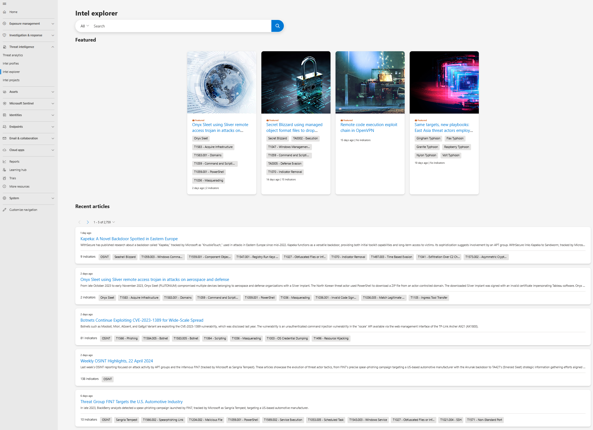
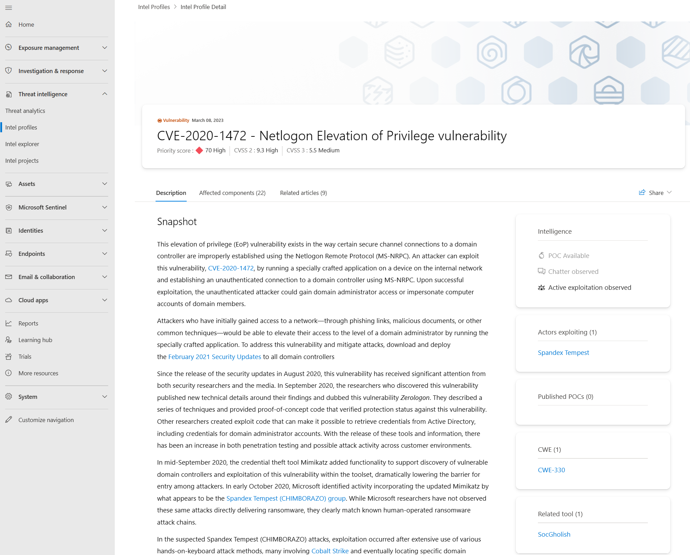
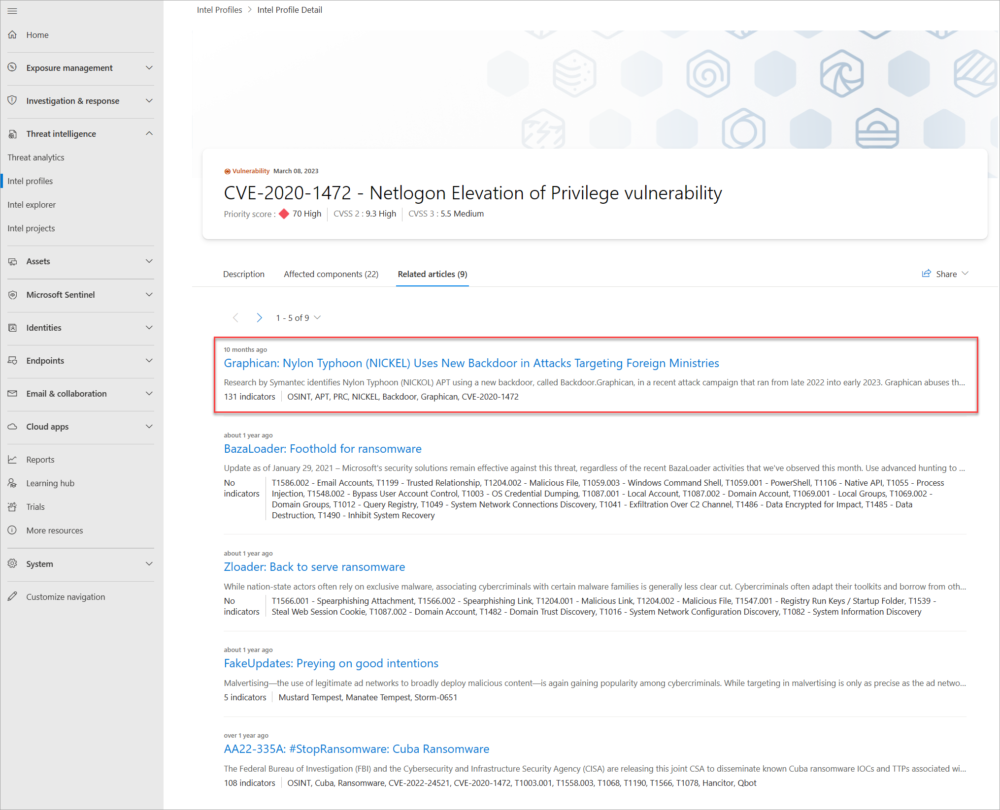
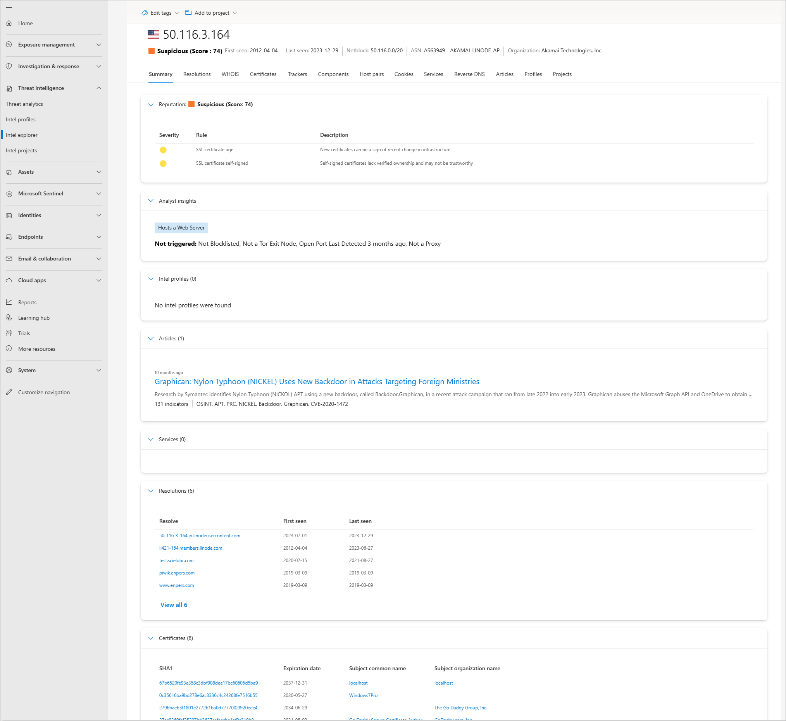
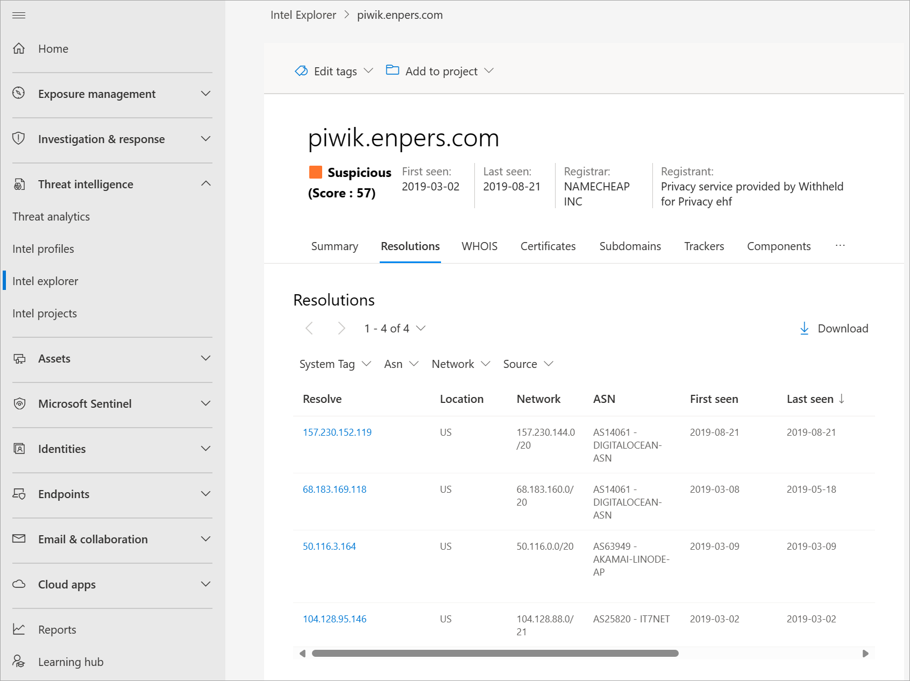
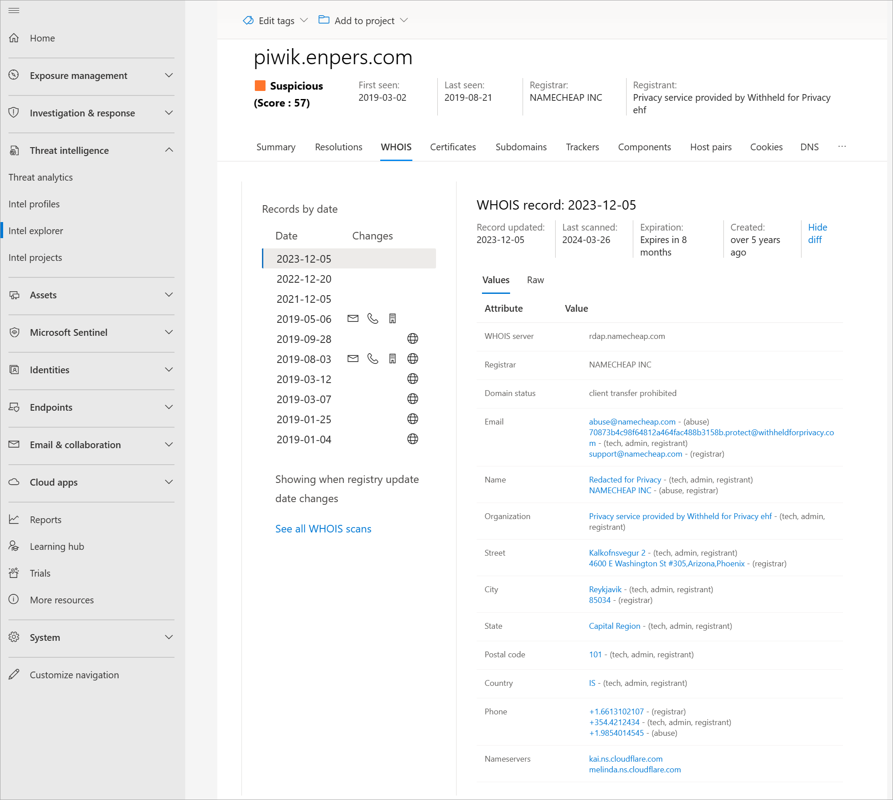

--- 
title: 'Tutorial: Gathering vulnerability intelligence'
description: Practice gathering vulnerability intelligence using Microsoft Defender Threat Intelligence (Defender TI).
author: alexroland24
ms.author: aroland
manager: dolmont
ms.service: threat-intelligence 
ms.topic: tutorial
ms.date: 08/04/2022
ms.custom: template-tutorial
---

# Tutorial: Gathering vulnerability intelligence

>[!IMPORTANT] 
> On June 30, 2024, The Microsoft Defender Threat Intelligence (Defender TI) standalone portal (https://ti.defender.microsoft.com) will be retired and will no longer be accessible. Customers can continue using Defender TI in the [Microsoft Defender portal](https://aka.ms/mdti-intel-explorer) or with [Microsoft Copilot for Security](security-copilot-and-defender-threat-intelligence.md). [Learn more](https://aka.ms/mdti-standaloneportal)

This tutorial walks you through how to perform several types of indicator searches to gather vulnerability intelligence using Microsoft Defender Threat Intelligence (Defender TI) in the Microsoft Defender portal.

## Prerequisites

- A Microsoft Entra ID or personal Microsoft account. [Sign in or create an account](https://signup.microsoft.com/)
- A Defender TI Premium license.

    > [!NOTE]
    > Users without a Defender TI Premium license can still access our free Defender TI offering.

## Disclaimer

Defender TI might include live, real-time observations and threat indicators, including malicious infrastructure and adversary-threat tooling. Any IP address and domain searches within Defender TI are safe to search. Microsoft shares online resources (for example, IP addresses, domain names) that are considered real threats posing a clear and present danger. We ask that you use their best judgment and minimize unnecessary risk while interacting with malicious systems when performing the following tutorial. Microsoft minimizes risks by defanging malicious IP addresses, hosts, and domains.

## Before you begin

As the disclaimer states previously, suspicious and malicious indicators are defanged for your safety. Remove any brackets from IP addresses, domains, and hosts when searching in Defender TI. Don’t search these indicators directly in your browser.

## Open Defender TI in the Microsoft Defender portal

1. Access the [Defender portal](https://security.microsoft.com/) and complete the Microsoft authentication process. [Learn more about the Defender portal](/defender-xdr/microsoft-365-defender-portal)
2. Navigate to **Threat intelligence** > **Intel explorer**.

## Learn about Intel explorer home page features

1. Review the Intel explorer search bar options by selecting its drop-down menu.

    

2. Scroll down and review the featured and recent articles in their respective sections. [Learn more about Defender TI articles](what-is-microsoft-defender-threat-intelligence-defender-ti.md#articles)

    
    
## Perform indicator searches and gather vulnerability intelligence

1. Search *CVE-2020-1472* in the **Intel explorer** search bar, the select and review the associated Intel profile *CVE-2020-1472 - Netlogon Elevation of Privilege vulnerability*.

    

2. Select the profile’s **Related articles** tab then select the article *Graphican: Nylon Typhoon (NICKEL) Uses New Backdoor in Attacks Targeting Foreign Ministries*.

    

3. Select this newly opened article’s **Public indicators**. You should see the IP address 50.116.3[.]164 among the listed indicators.

    

4. Navigate back to the **Intel explorer** search bar and search *50.116.3[.]164*.
5. Review the following results in the **Summary** tab: 
   - Reputation
   - Analyst insights
   - Articles
   - Services
   - Resolutions
   - Certificates
   - Projects
      
    

    You can also select and review the information in their respective tabs. 

6. Select the **Resolutions** tab then select *piwik.enpers[.]com*.

    

7. Review this domain’s resolutions, WHOIS, certificates, subdomains, trackers, components, cookies, DNS, and reverse DNS data sets.

    
    
10. Perform the respective artifact searches from the previous steps. You could reference and use the different search options in **Intel explorer** search bar dropdown menu.

## Clean up resources

There are no resources to clean up in this section.

### See also
- [Tutorial: Gathering vulnerability intelligence](gathering-threat-intelligence-and-infrastructure-chaining.md)
