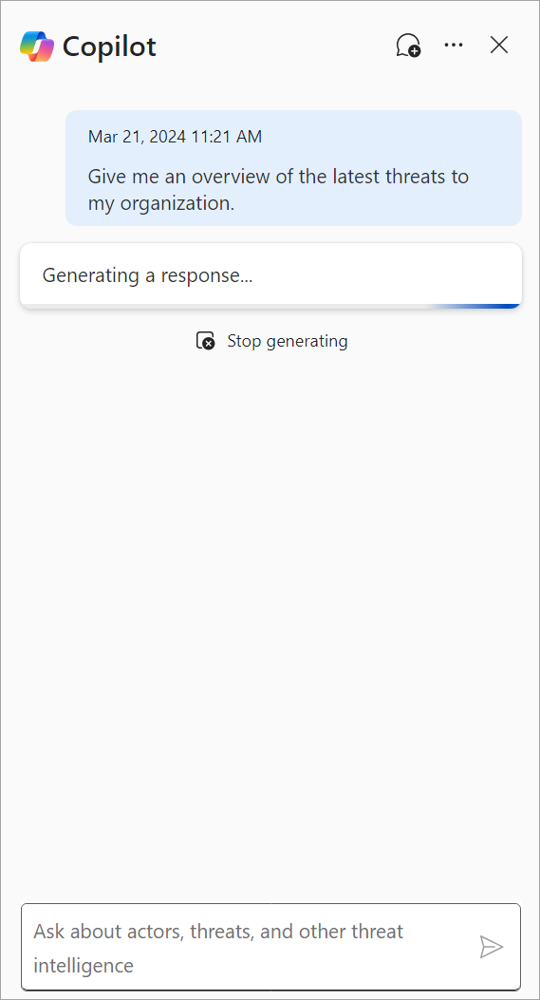
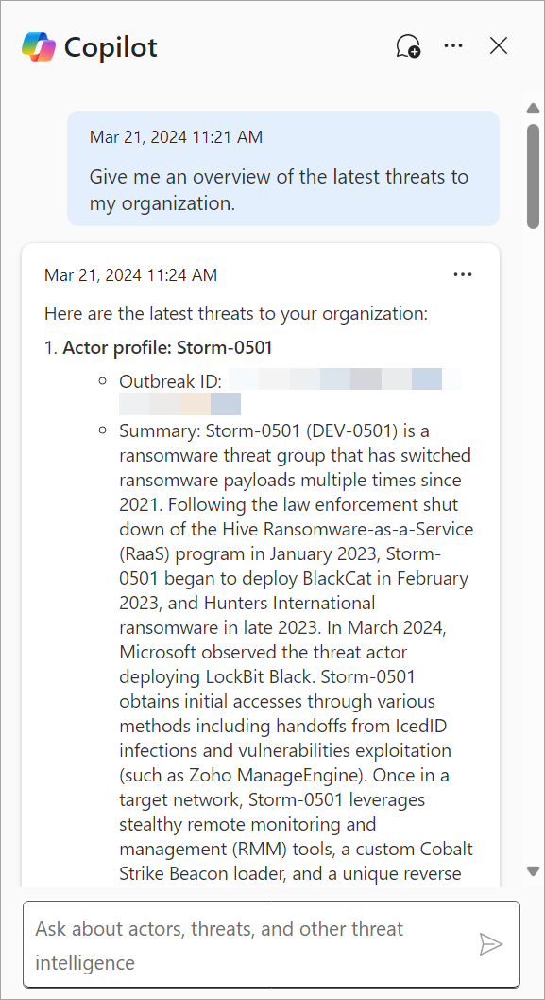

# Using Microsoft Copilot for Security for threat intelligence

**Applies to:**
- [Microsoft Defender XDR](/defender-xdr)

Microsoft Copilot in Defender applies the capabilities of [Microsoft Copilot for Security](/security-copilot/microsoft-security-copilot) to deliver Microsoft Defender Threat Intelligence (Defender TI) information about threat actors and tools, as well as contextual threat intelligence, directly into the Microsoft Defender portal. Based on threat analytics reports, intel profiles, and other available Defender TI content, you can use Copilot in Defender to summarize the latest threats affecting your organization, know which threats to prioritize based on your exposure level, or gain more knowledge about your organization's or the global threat landscape.

> [!NOTE]
> Defender TI capabilities are also available in Copilot for Security standalone experience through the Microsoft Defender Threat Intelligence plugin. [Learn more about Defender TI integration with Copilot for Security](security-copilot-and-defender-threat-intelligence.md)

## Technical requirements

Copilot for Security customers gain for each of their authenticated Copilot users access to Defender TI within the Defender portal. [Learn how you can get started with Copilot for Security](/security-copilot/get-started-security-copilot)

## Accessing Copilot in Defender for threat intelligence content

You can experience Copilot for Security’s capability to look up threat intelligence in the following pages of the Defender portal:
- Threat analytics
- Intel profiles
- Intel explorer
- Intel projects

## Try your first request
1. Open any of the pages mentioned previously from the Defender portal navigation bar. The Copilot side pane appears on the right hand side.

   :::image type="content" source="/defender/threat-intelligence/media/defender-ti-and-copilot/copilot-defender-side-pane.png" alt-text="Screenshot of the Microsoft Defender portal Threat analytics page with the open Microsoft Copilot in Defender side pane highlighted." lightbox="/defender/threat-intelligence/media/defender-ti-and-copilot/copilot-defender-side-pane.png":::

   You can also reopen Copilot by selecting the **Copilot icon**  at the top of the page.
2. In the Copilot prompt bar, ask about a threat actor, attack campaign, or any other threat intelligence that you want to know more about, then select the **Send message** icon  or press **Enter**. [See sample prompts for Defender TI](security-copilot-and-defender-threat-intelligence.md#sample-prompts-for-defender-ti)

3. Copilot generates a response from your text instruction or question. While Copilot is generating, you can cancel the response by selecting **Stop generating**.
   
    

4. Review the generated response. Copilot typically generates responses that include summaries and links to related Defender TI intel profiles and articles.

    

5. You can provide feedback about the generated response by selecting the **Provide feedback** icon  and choosing **Confirmed, it looks great**; **Off-target, inaccurate**; or **Potentially harmful, inappropriate**. [Learn more](/defender-xdr/security-copilot-in-microsoft-365-defender#data-security-and-feedback-in-copilot)
6. To start a new chat session with Copilot, select the **New chat** icon .

> [!NOTE]
> Copilot saves your sessions from the Defender portal in the [Copilot for Security standalone portal](https://go.microsoft.com/fwlink/?linkid=2247989). To see the previous sessions, from the Copilot [Home menu](/security-copilot/navigating-security-copilot#home-menu), go to **My sessions**. [Learn more about navigating Microsoft Copilot for Security](/security-copilot/navigating-security-copilot)

> [!IMPORTANT] 
> Copilot in Defender starts a new chat session every time you navigate to a different *Threat intelligence* page (for example, when you go from *Threat analytics* to *Intel profiles*) in the Defender portal. If you wish to go back or continue a previous session, go to the Copilot for Security standalone portal.

## Use the built-in Defender TI prompts

Copilot in Defender also has the following built-in prompts when accessing the *Threat intelligence* pages to get you started:

- [Summarize](#summarize-the-latest-threats-related-to-your-organization)
- [Prioritize](#prioritize-which-threats-to-focus-on)
- [Ask](#ask-about-the-threat-actors-targeting-the-communications-infrastructure)

:::image type="content" source="/defender/threat-intelligence/media/defender-ti-and-copilot/copilot-defender-prompts.png" alt-text="Screenshot of the Microsoft Defender portal Threat analytics page with the built-in prompts in the open Copilot in Defender side pane highlighted." lightbox="/defender/threat-intelligence/media/defender-ti-and-copilot/copilot-defender-prompts.png":::

### Summarize the latest threats related to your organization
Gathering and digesting threat intelligence data and trends can be a daunting task, especially when they come from multiple data sets and sources. Choose the **Summarize** prompt if you want Copilot to give you an overview of the latest threats in your environment. Copilot lists and summarizes relevant campaigns, activities, and threat actors, and includes links to related threat analytics reports or intel profiles for more information.

### Prioritize which threats to focus on
Copilot provides insights on which threats you should prioritize and focus on based on your environment's highest exposure level to these threats. Choose the **Prioritize** prompt if you want to find out which threats are likely to significantly impact your organization. This prompt gives you a starting point and could thus make triaging, investigating, and mitigating incidents less complex.

### Ask about the threat actors targeting the communications infrastructure

An important aspect of threat intelligence is keeping up to date with the global threat landscape. Choose the **Ask** prompt if you want Copilot to summarize the latest threat articles about threat actors that target the communications infrastructure so you can gather information on their latest TTPs or campaigns, and promptly assess and apply mitigation or prevention strategies. 

### See also
- [What is Microsoft Copilot for Security?](/security-copilot/microsoft-security-copilot)
- [Microsoft Copilot for Security and Microsoft Defender Threat Intelligence](security-copilot-and-defender-threat-intelligence.md)
