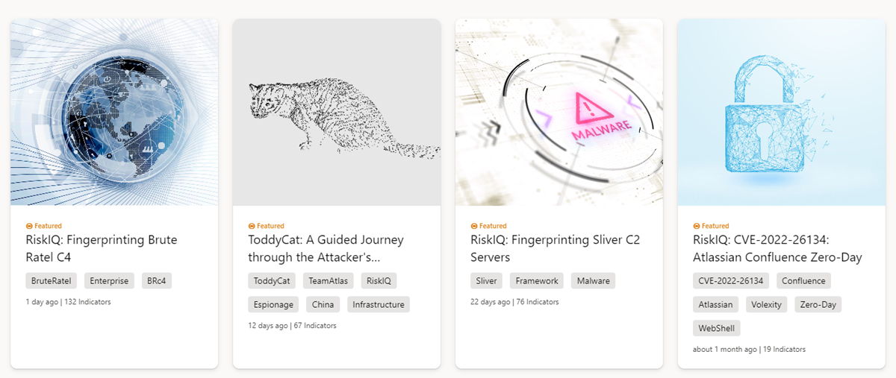
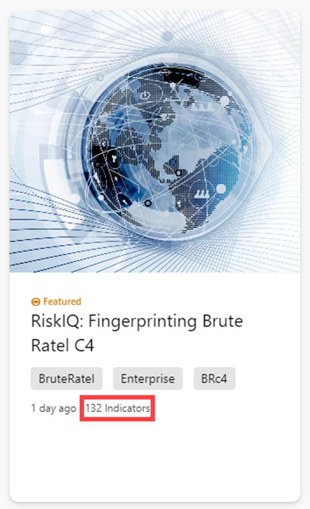

--- 
title: 'What is Microsoft Defender Threat Intelligence (Defender TI)?'
description: 'In this overview article, learn about the main features that come with Microsoft Defender Threat Intelligence (Defender TI).'
author: alexroland24
ms.author: aroland
manager: dolmont
ms.service: threat-intelligence 
ms.collection: essentials-overview
ms.topic: overview
ms.date: 08/02/2022
ms.custom: template-overview
---

# What is Microsoft Defender Threat Intelligence (Defender TI)?

>[!IMPORTANT] 
> On June 30, 2024, The Microsoft Defender Threat Intelligence (Defender TI) standalone portal (https://ti.defender.microsoft.com) was retired and is no longer accessible. Customers can continue using Defender TI in the [Microsoft Defender portal](https://aka.ms/mdti-intel-explorer) or with [Microsoft Copilot for Security](security-copilot-and-defender-threat-intelligence.md). [Learn more](https://aka.ms/mdti-standaloneportal)

Microsoft Defender Threat Intelligence (Defender TI) is a platform that streamlines triage, incident response, threat hunting, vulnerability management, and threat intelligence analyst workflows when conducting threat infrastructure analysis and gathering threat intelligence. With security organizations actioning an ever-increasing amount of intelligence and alerts within their environment, having a threat analysis an intelligence platform that allows for accurate and timely assessments of alerting is important.

Analysts spend a significant amount of time on data discovery, collection, and parsing, instead of focusing on what actually helps their organization defend themselves—deriving insights about the actors through analysis and correlation. Often, these analysts must go to multiple repositories to obtain the critical data sets they need to assess a suspicious domain, host, or IP address. DNS data, WHOIS information, malware, and SSL certificates provide important context to indicators of compromise (IOCs), but these repositories are widely distributed and don't always share a common data structure. 

This wide distribution of repositories makes it difficult for analysts to ensure that they have all relevant data they need to make a proper and timely assessment of suspicious infrastructure. Interacting with these data sets can also be cumbersome, and pivoting between these repositories is time-consuming and drains the resources of security operations groups that constantly need to reprioritize their response efforts.

Threat intelligence analysts struggle with balancing a breadth of threat intelligence ingestion with the analysis of which threat intelligence poses the biggest threats to their organization and/or industry. In the same breadth, vulnerability intelligence analysts battle correlating their asset inventory with Common Vulnerabilities and Exposures (CVE) information to prioritize the investigation and remediation of the most critical vulnerabilities associated with their organization.

Microsoft reimagines the analyst workflow by developing Defender TI, which aggregates and enriches critical data sources and displays them in an innovative, easy-to-use interface where users can correlate indicators of compromise (IOCs) with related articles, actor profiles, and vulnerabilities. Defender TI also lets analysts collaborate with fellow Defender TI-licensed users within their tenant on investigations. 

The following is a screenshot of Defender TI's **Intel explorer** page in the Microsoft Defender portal. Analysts can quickly scan new featured articles and perform a keyword, indicator, or CVE ID search to begin their intelligence gathering, triage, incident response, and hunting efforts.

:::image type="content" source="/defender/threat-intelligence/media/intel-explorer.png" alt-text="ti Overview Home Page Chrome Screenshot." lightbox="/defender/threat-intelligence/media/intel-explorer.png":::

## Defender TI articles
Articles are narratives that provide insight into threat actors, tooling, attacks, and vulnerabilities. Defender TI articles aren't blog posts about threat intelligence; while these articles summarize different threats, they also link to actionable content and key IOCs to help users take action. Having this technical information in the threat summaries lets users continually track threat actors, tooling, attacks, and vulnerabilities as they change.

### Featured articles

The **Featured articles** section of the Intel explorer page (right below the search bar) displays the banner images of noteworthy Microsoft content:

Selecting a featured article banner loads it full article content. The article's **Snapshot** gives you a quick understanding of the article. The **Indicators** call-out shows how many public and Defender TI indicators are associated with the article.

### Articles

All articles (including the featured articles) are listed in the **Recent articles** section according to their publication date, with the most recent one on top.

:::image type="content" source="/defender/threat-intelligence/media/intel-explorer-articles.png" alt-text="TI Overview Articles." lightbox="/defender/threat-intelligence/media/intel-explorer-articles.png":::

The **Description** section of an article contains information about the profiled attack or threat actor. The content can be short—such as open-source intelligence (OSINT) bulletins—or long (for long-form reporting, especially when Microsoft augments the report with their own analysis). The longer descriptions might contain images, links to the underlying content, links to searches within Defender TI, attacker code snippets, and firewall rules to block the attack.

:::image type="content" source="/defender/threat-intelligence/media/article-description.png" alt-text="TI Overview Article Description." lightbox="/defender/threat-intelligence/media/article-description.png":::

The **Public indicators** section lists the known indicators related to the article. The links in these indicators take you to relevant Defender TI data or external sources.

:::image type="content" source="/defender/threat-intelligence/media/article-public-indicators.png" alt-text="TI Overview Article Public Indicators." lightbox="/defender/threat-intelligence/media/article-public-indicators.png":::

The **Defender TI indicators** section covers the indicators that Defender TI's own research team finds related to the articles. The links in these indicators also take you to relevant Defender TI data or external sources.

These links also pivot into the relevant Defender TI data or the corresponding external source.

:::image type="content" source="/defender/threat-intelligence/media/article-defender-ti-indicators.png" alt-text="TI Overview Article Defender TI Indicators." lightbox="/defender/threat-intelligence/media/article-defender-ti-indicators.png":::

### Vulnerability articles

Defender TI offers CVE ID searches to help you identify critical information about the CVE. CVE ID searches result in vulnerability articles. 

Each vulnerability article contains:
- A description of the CVE
- A list of affected components
- Tailored mitigation procedures and strategies
- Related intelligence articles
- References in deep and dark web chatter
- Other key observations

These articles provide deeper context and actionable insights behind each CVE, letting users understand and mitigate these vulnerabilities more quickly.

Vulnerability articles also include a **Defender TI priority score** and severity indicator. The Defender TI priority score is a unique algorithm that reflects the priority of a CVE based on the Common Vulnerability Scoring System (CVSS) score, exploits, chatter, and linkage to malware. It evaluates the recency of these components so you can understand which CVEs should be remediated first.

## Reputation scoring

IP reputation data is important to understanding the trustworthiness of your own attack surface and is also useful when assessing unknown hosts, domains, or IP addresses that appear in investigations. Defender TI provides proprietary reputation scores for any host, domain, or IP address. Whether validating the reputation of a known or unknown entity, these scores helps you understand any detected ties to malicious or suspicious infrastructure quickly. 

:::image type="content" source="/defender/threat-intelligence/media/reputation-score-summary-card.png" alt-text="Reputation summary card." lightbox="/defender/threat-intelligence/media/reputation-score-summary-card.png":::

Defender TI provides quick information about the activity of these entities, such as first- and last-seen timestamps, Autonomous System Number (ASN), country or region, associated infrastructure, and a list of rules that impact the reputation score, when applicable. 

[Read more about reputation scoring](reputation-scoring.md)

## Analyst insights

Analyst insights distill Microsoft's vast data set into a handful of observations that simplify the investigation and make it more approachable to analysts of all levels.

Insights are meant to be small facts or observations about a domain or IP address. They provide you with the ability to assess the queried indicator and improve your ability to determine if an indicator you're investigating is malicious, suspicious, or benign.

:::image type="content" source="/defender/threat-intelligence/media/analyst-insights-01.png" alt-text="Analyst insights summary card." lightbox="/defender/threat-intelligence/media/analyst-insights-01.png":::

[Read more about analyst insights](analyst-insights.md)

## Data sets
Microsoft centralizes numerous data sets into Defender TI, making it easier for Microsoft's community and customers to conduct infrastructure analysis. Microsoft's primary focus is to provide as much data as possible about internet infrastructure to support various security use cases.

Microsoft collects, analyzes, and indexes internet data using passive domain name systems (DNS) sensors, port scanning, URL and file detonation, and other sources to assist users in detecting threats, prioritizing incidents, and identifying infrastructure associated with threat actor groups. Your URL searches might be used to automatically initiate detonations if there's no available detonation data for a URL at the time of the request. The data collected from such detonations is used to populate results for any future searches for that URL from you or any other Defender TI users.

Supported internet datasets include:
- Resolutions
- WHOIS
- SSL certificates
- Subdomains
- DNS
- Reverse DNS
- Detonation analysis
- Derived data sets collected from the Document Object Model (DOM) of detonated URLs, including: 
  - Trackers
  - Components
  - Host pairs
  - Cookies 

Components and trackers are also observed from detection rules that are triggered based on the banner responses from port scans or SSL certificate details. Many of these data sets have various methods to sort, filter, and download data, making it easier to access information that might be associated with a specific indicator type or time in history.

:::image type="content" source="/defender/threat-intelligence/media/data-sets-01.png" alt-text="Sorting data sets screenshot." lightbox="/defender/threat-intelligence/media/data-sets-01.png":::

Learn more:
- [Sorting, filtering, and downloading data](sorting-filtering-and-downloading-data.md)
- [Data sets](data-sets.md)

## Tags

Defender TI tags provide quick insight about an indicator, whether derived by the system or generated by other users. Tags aid analysts in connecting the dots between current incidents and investigations and their historical context for improved analysis.

Defender TI offers two types of tags: system tags and custom tags. 

[Learn more about using tags](using-tags.md)

## Projects

Defender TI lets users develop multiple project types for organizing indicators of interest and indicators of compromise from an investigation. **Projects** contain a list of all associated indicators and a detailed history that retains the names, descriptions, and collaborators.

When you search an IP address, domain, or host in Defender TI, and if that indicator is listed within a project you have access to, you can see a link to the project from the **Intel projects** page, in the **Summary** and **Data** tabs. From there, you can navigate to the details of the project for more context about the indicator before reviewing the other data sets for more information. You can therefore avoid reinventing the wheel of an investigation that one of your Defender TI tenant users might have already started. If someone adds you as a collaborator to a project, you can also add onto that investigation by adding new IOCs.

:::image type="content" source="/defender/threat-intelligence/media/project-details.png" alt-text="Project details screenshot." lightbox="/defender/threat-intelligence/media/project-details.png":::

[Learn more about using projects](using-projects.md)

## Data residency, availability, and privacy

Defender TI contains both global data and customer-specific data. The underlying internet data is global Microsoft data; labels applied by customers are considered customer data. All customer data is stored in the region of the customer's choosing.

For security purposes, Microsoft collects users' IP addresses when they sign in. This data is stored for up to 30 days but might be stored longer if needed to investigate potential fraudulent or malicious use of the product.

In there's a region down scenario, customers should see no downtime as Defender TI uses technologies that replicate data to backup regions.

Defender TI processes customer data. By default, customer data is replicated to the paired region.

### See also

- [Quickstart: Learn how to access Microsoft Defender Threat Intelligence and make customizations](learn-how-to-access-microsoft-defender-threat-intelligence-and-make-customizations-in-your-portal.md)
- [Data sets](data-sets.md)
- [Searching and pivoting](searching-and-pivoting.md)
- [Sorting, filtering, and downloading data](sorting-filtering-and-downloading-data.md)
- [Infrastructure chaining](infrastructure-chaining.md)
- [Reputation scoring](reputation-scoring.md)
- [Analyst insights](analyst-insights.md)
- [Using projects](using-projects.md)
- [Using tags](using-tags.md)
